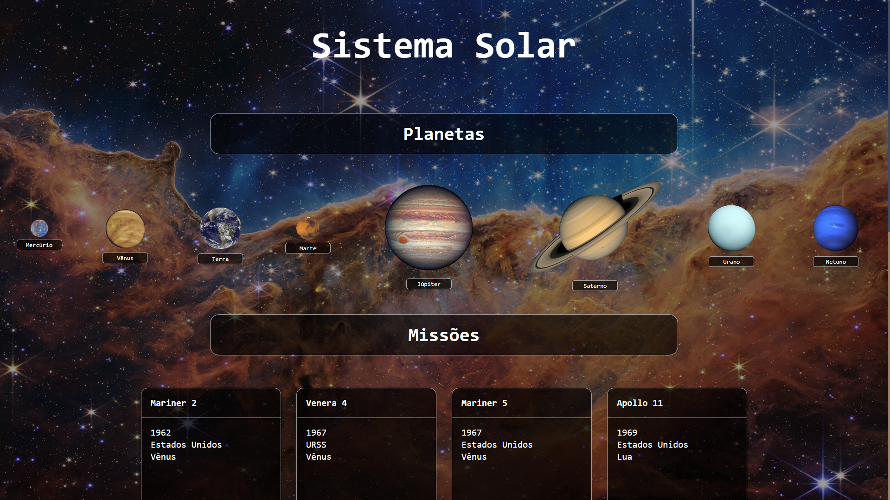

<h1 align="center">Projeto - Sistema Solar</h1>

<strong>👨‍💻 O que foi desenvolvido</strong>
 

Neste projeto eu desenvolvi um modelo do sistema solar! Ao utilizar essa aplicação, uma pessoa usuária deverá ser capaz de:

    * Visualizar todos os planetas do sistema solar renderizados na tela;

    * Visualizar todas as cartas com informações sobre missões espaciais;

   

